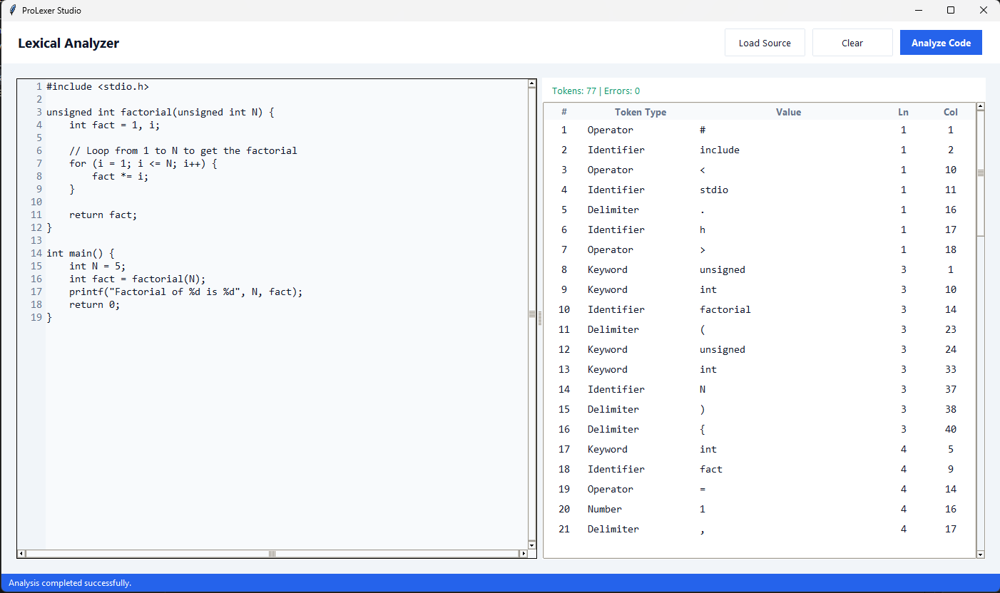

# ProLexer Studio

> **Professional-grade Lexical Analysis Engine for C-like Programming Languages**

A sophisticated lexical analyzer built with enterprise-level architecture, designed for educational purposes, compiler research, and language processing applications.



---

## Overview

ProLexer Studio is a production-ready lexical analysis tool that performs tokenization of C-like source code with high precision and detailed error reporting. Built on solid software engineering principles, it demonstrates best practices in lexer implementation while maintaining an accessible codebase for educational purposes.

### Key Capabilities

- **Comprehensive Token Recognition**: Accurate identification and classification of keywords, identifiers, numeric literals, operators, string literals, and delimiters
- **Intelligent Error Detection**: Real-time validation with detailed reporting of lexical errors including unclosed strings and malformed numeric constants
- **Enterprise Architecture**: Clean MVC separation with fully type-hinted Python codebase for maximum maintainability
- **Professional User Interface**: Modern, responsive GUI with custom theming and intuitive workflow
- **Zero Dependencies**: Runs on standard Python 3 without external packages

---

## Features

### Lexical Analysis Engine

- **Multi-token Support**: Recognizes 32 standard C keywords, all common operators, and properly categorizes identifiers
- **Numeric Literal Parsing**: Handles integers, floating-point numbers, and scientific notation with validation
- **String Processing**: Accurate string literal tokenization with proper escape sequence handling
- **Comment Filtering**: Intelligent detection and removal of single-line and multi-line comments
- **Error Recovery**: Continues analysis after encountering errors to provide comprehensive feedback

### User Interface

- **Interactive Table View**: Sortable, searchable token display with columns for token type, lexeme, line number, and position
- **Source Code Preview**: Syntax-aware text display with line numbering
- **Status Indicators**: Real-time feedback on analysis progress and error states
- **File Management**: Built-in file browser with support for multiple file formats
- **Responsive Design**: Adaptive layout that maintains usability across different screen sizes

### Code Quality

- **Type Safety**: Complete type annotations using Python's typing module
- **Clean Architecture**: Strict separation of concerns following MVC pattern
- **Maintainable Code**: Clear naming conventions, comprehensive docstrings, and logical organization
- **Extensibility**: Modular design allows easy addition of new token types and language features

---

## Installation

### Prerequisites

- Python 3.8 or higher
- Tkinter (included with most Python distributions)

### Setup

```bash
# Clone the repository
git clone https://github.com/khatri90/LexicalAnalyzer.git

# Navigate to the project directory
cd LexicalAnalyzer/ProfessionalLexer

# Verify Python version
python --version

# Run the application
python main.py
```

### Verification

To verify the installation is working correctly, run the application and load a sample C source file. The tokenization should complete without errors for valid C code.

---

## Usage

### Quick Start

1. **Launch Application**
   ```bash
   python main.py
   ```

2. **Load Source Code**
   - Click the **Load Source** button
   - Select a C source file (.c, .h) or any text file
   - The source code will appear in the left panel

3. **Perform Analysis**
   - Click the **Analyze Code** button
   - Tokens will appear in the right panel table
   - Check the status bar for errors or success confirmation

4. **Review Results**
   - Browse tokens in the interactive table
   - Sort by clicking column headers
   - Review line numbers and positions for each token

### Example Workflow

```c
// Sample C code (input)
int main() {
    float x = 3.14;
    printf("Hello, World!\n");
    return 0;
}
```

**Output**: The lexer will generate tokens including:
- `KEYWORD: int` (line 2, pos 0)
- `IDENTIFIER: main` (line 2, pos 4)
- `DELIMITER: (` (line 2, pos 8)
- And so on...

### Error Handling

The lexer provides detailed error messages for common issues:

- **Unclosed String**: `Unclosed string starting at line X`
- **Invalid Number**: `Invalid number format at line X`
- **Unexpected Character**: Logged with position information

---

## Project Structure

```text
ProfessionalLexer/
├── main.py                      # Application entry point
├── README.md                    # Project documentation
├── ss.png                       # Application screenshot
└── src/
    ├── model/                   # Business logic layer
    │   ├── token.py             # Token type definitions and data classes
    │   └── lexer.py             # Core lexical analysis engine
    └── view/                    # Presentation layer
        ├── theme.py             # UI theme constants and color schemes
        ├── components.py        # Reusable styled UI components
        └── main_window.py       # Main application window and controller
```

### Architecture

**Model Layer** (`src/model/`)
- `token.py`: Defines `TokenType` enum and `Token` dataclass for type-safe token representation
- `lexer.py`: Implements the `Lexer` class with core tokenization logic, state management, and error handling

**View Layer** (`src/view/`)
- `theme.py`: Centralized theme configuration with color schemes and UI constants
- `components.py`: Custom tkinter widgets with consistent styling
- `main_window.py`: Main GUI controller orchestrating user interactions and view updates

---

## Technical Details

### Supported Token Types

| Category | Types |
|----------|-------|
| **Keywords** | int, float, char, void, if, else, while, for, return, etc. (32 total) |
| **Operators** | Arithmetic (+, -, *, /), Relational (==, !=, <, >), Logical (&&, \|\|, !), Assignment (=) |
| **Delimiters** | Parentheses, braces, brackets, semicolons, commas |
| **Literals** | Integer, float, scientific notation, string literals |
| **Identifiers** | Variable and function names following C conventions |

### Lexical Analysis Algorithm

1. **Preprocessing**: Remove comments and normalize whitespace
2. **Tokenization**: Character-by-character scanning with lookahead
3. **Classification**: Pattern matching against keyword dictionary and regex patterns
4. **Validation**: Syntax checking for numeric and string literals
5. **Output Generation**: Creation of Token objects with metadata

---

## Contributing

Contributions are welcome. When submitting improvements:

1. Maintain the existing code style and type annotations
2. Ensure all functions have proper docstrings
3. Test with various C source files to verify correctness
4. Update documentation for any new features

---

## License

**MIT License**

This project is licensed under the MIT License, making it free for educational, research, and commercial use. See the LICENSE file for complete terms.

---

## Acknowledgments

Built with focus on clean code principles and modern software engineering practices. Designed to serve as both a practical tool and an educational reference for lexical analysis implementation.

---

**ProLexer Studio** - Where Professional Code Analysis Begins
